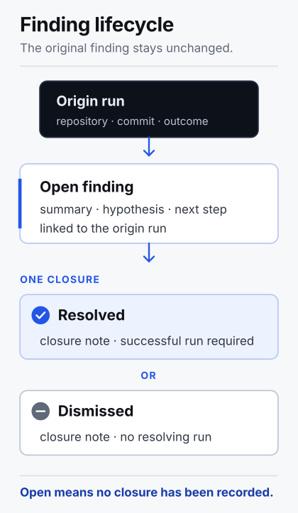

# Architecture

Motus Work Ledger is one command-line program backed by one project-local
SQLite database. It runs on demand without a server or background service.

## Workflow boundary

Motus owns a small, fixed record contract. The workflow that invokes Motus
decides what to record, when to search, and whether selected output should move
to another system.

External systems remain authoritative for their own records. Motus does not
manage adapters, routing rules, organizational taxonomies, or producer
identity. A run projection moves once from open to closed. Events, findings,
and closures are append-enforced under normal application writes. External
authored content enters only when the caller adds a bounded finding to a closed
run or appends a bounded closure note.

## Command flow

Motus reads Git metadata, creates an open run, and starts the command directly
without a shell. Command arguments and stdin reach the child process but are
not copied into a Motus record. Raw output is forwarded and counted, not
buffered in the ledger. Closing the run appends its terminal event and updates
the run projection in one transaction. A program can detect that its stdout and
stderr are pipes, so formatting can differ from a direct invocation.

Findings use a separate, explicit path:

Finding and closure payloads never enter through a command-line value. This
keeps those payloads out of ordinary process listings and shell history. File
paths and `--query` search terms are command-line values. Motus does not create
findings by watching output or inferring a lesson from a run.

## Packages

- `cmd/motus` wires process signals and exit status to the CLI.
- `internal/cli` owns command parsing, output, and the record lifecycle.
- `internal/capture` supervises a process group or Windows Job Object, copies
  both output streams, and stops the tree if an output destination fails.
- `internal/gitmeta` reads repository root, commit, and dirty state with
  bounded output and a two-second deadline.
- `internal/store` owns the SQLite schema, transactions, projections, and
  consistency checks.

The packages are internal. The CLI is the supported application interface.
Receipt JSON is versioned as `motus.work-receipt.v1`. The SQLite store is
managed by Motus and should not be written directly.

## Store

The database is `.motus/ledger.db` unless the operator chooses another state
directory. New state directories and database files use private POSIX modes.
The application resolves symlinks in parent components and refuses a state
directory or database file that is itself a symlink. Windows network and
device paths are rejected.

Writable SQLite connections run with:

- `TRUNCATE` rollback-journal mode
- `synchronous=FULL`
- foreign keys and recursive triggers enabled
- `trusted_schema=OFF`
- one connection per Motus process
- immediate write transactions with bounded busy retries

TRUNCATE commits by reducing the rollback journal to zero bytes instead of
deleting it. This avoids delete races between Windows processes while
preserving rollback-journal durability. A clean `ledger.db-journal` may remain
beside the database.

Rollback-journal mode lets list, show, receipt, and doctor reopen a cleanly
closed current ledger with `mode=ro` and `query_only=ON` when the state
directory and its files are non-writable. Read-only connections report SQLite's
`DELETE` default because non-WAL journal modes are connection-scoped; they do
not change or delete the clean zero-length journal. If a process dies during a
transaction, SQLite needs one writable open to roll back its non-empty journal
before reads can become side-effect-free again.

A ledger last opened by versions through v0.1.4 is migrated from WAL on its
next current-version open. Motus validates an isolated copy of the exact schema
before opening the source writable or changing it out of WAL mode.
The transition requires exclusive write access with every process using the
ledger stopped; records and deterministic receipt bytes do not change. Do not
open a migrated ledger with v0.1.4 or older: those versions re-enable WAL.
If that happens, stop every process and run a current `motus doctor` to migrate
the ledger again.

The schema has five tables: append-enforced metadata, runs, append-only events,
findings, and finding closures. A run moves once from `open` to `closed`.
Closing appends the final
`run.terminal` event and updates the run projection in the same transaction.
Database triggers reject event mutation, deletion, sequence gaps, writes after
the terminal event, run deletion, start-metadata mutation, and changes to a
closed run. Findings can reference only closed runs. A finding remains open
until one append-only closure resolves it with a closed successful run or
dismisses it with a note.

## Receipts

`motus run receipt RUN_ID` reads a run and its ordered events in one read
transaction. Projection stops if a payload hash, sequence, terminal position,
or terminal payload does not match the run projection.

The output schema is `motus.work-receipt.v1`. Its `receipt_sha256` is the
lowercase SHA-256 digest of the exact compact JSON bytes in the `receipt`
member. Projection has no current-time field, so unchanged stored data produces
the same receipt.

Findings and finding closures are not part of a run receipt. Adding or closing
a finding does not change the receipt bytes for the referenced run.

The hash detects an inconsistent receipt member. It is not a signature and
does not identify an independent observer. GitHub artifact attestations can
verify that a release archive was built by this repository's release workflow.
They do not apply to records in a local ledger.

## Failure behavior

Motus does not run a command if it cannot create the open record. After a
command starts, a downstream output failure terminates the supervised process
group or Job Object, waits for output forwarding to finish, then closes the run
as failed. Cancellation follows the same process-tree boundary and closes the
run as aborted. A signal received after the command has completed still
determines Motus's process exit status, but does not replace the recorded
command outcome.

An abrupt Motus crash can leave an open run. Committed events remain valid and
ordered, and the run remains open for inspection.

## Scope

Version 0.1 does not include:

- transcript or raw-output capture
- a daemon or automatic observation
- signing, timestamping, or third-party attestation
- workflow orchestration
- automatic findings, recommendations, or model-based retrieval

Version 0.1 is limited to local command records, receipts, and findings that a
user chooses to add.
