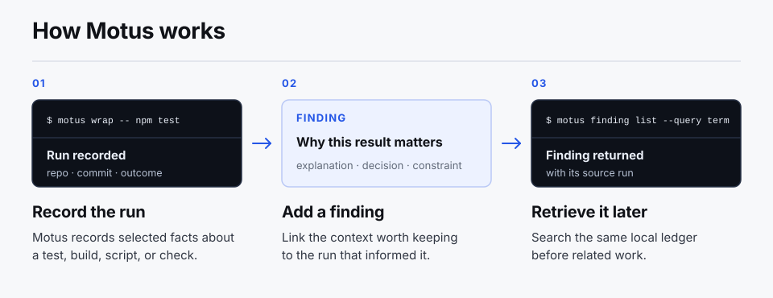

# Motus Work Ledger

**A work ledger for AI-assisted engineering.**

Motus connects the reason behind a fix or decision to the run and Git state
that informed it. Later, a developer or coding agent can find that context
before similar work.

<picture>
  <source media="(max-width: 640px)" srcset="docs/motus-workflow-mobile.svg">
  
</picture>

A **run** records selected machine facts such as the repository, commit,
outcome, and time. A **finding** holds the explanation, constraint, workaround,
decision, or next step worth keeping. A developer or agent decides what
deserves a finding. The same CLI also works from CI.

Keep standing rules in project documentation. Use Motus when the source run and
its recorded Git state, outcome, or resolution will matter later. The ledger is
local by default.

## Install

Download a prebuilt archive for macOS, Linux, or Windows from the
[latest release](https://github.com/motus-os/work-ledger/releases/latest).
Each release includes SHA-256 checksums, SBOMs, and GitHub artifact
attestations. Unpack the archive and place `motus` or `motus.exe` on your
`PATH`.

If you have Go 1.26.5 or newer, you can install from source instead:

```console
$ go install github.com/motus-os/work-ledger/cmd/motus@latest
```

Go places the binary in `GOBIN`, or in `GOPATH/bin` when `GOBIN` is unset.
Confirm the installed command:

```console
$ motus version
```

<details>
<summary>Verify a release archive</summary>

Replace `ARCHIVE_NAME` with the exact downloaded filename. Attestation
verification uses the [GitHub CLI](https://cli.github.com/).

On macOS:

```console
$ grep "  ARCHIVE_NAME$" checksums.txt | shasum -a 256 -c -
$ gh attestation verify ARCHIVE_NAME --repo motus-os/work-ledger
```

On Linux:

```console
$ grep "  ARCHIVE_NAME$" checksums.txt | sha256sum -c -
$ gh attestation verify ARCHIVE_NAME --repo motus-os/work-ledger
```

On Windows PowerShell:

```powershell
$archive = "ARCHIVE_NAME"
$expected = (Get-Content checksums.txt | Where-Object { $_ -like "*  $archive" }).Split()[0]
$actual = (Get-FileHash $archive -Algorithm SHA256).Hash.ToLowerInvariant()
if ($actual -ne $expected) { throw "checksum mismatch" }
gh attestation verify $archive --repo motus-os/work-ledger
```

The macOS binaries are not Apple-notarized. After the checksum and GitHub
attestation pass, remove a browser-added quarantine flag if Gatekeeper blocks
the extracted binary:

```console
$ xattr -d com.apple.quarantine /path/to/motus
```

</details>

Before recording work, add `.motus/` to the project's `.gitignore`. Finding
text is content you submit, so review it before saving.

## Record a run and add a finding

This example records a failed test, the explanation, and the successful check
that resolved it. Replace `npm test` with any test, build, script, or tool you
already run. Example IDs are shortened and output is abridged.

### Record the command

```console
$ motus wrap -- npm test
motus: recorded run_0370... (failure)
```

Motus shows the command's output normally, returns its exit status, and prints
the next commands with the new run ID.

### Add the finding

Finding text is read from a file or standard input, not from a command-line
argument. Create `finding.txt` with one summary:

```text
The generated file was stale. Generate before testing.
```

```console
$ motus finding add --run run_0370... --file finding.txt
Recorded finding_1457... (open)
```

Use JSON when the likely cause and next step should be separate fields:

```json
{
  "summary": "The generated file was stale.",
  "hypothesis": "Generation did not run before the test.",
  "next_step": "Generate the file, then rerun the test."
}
```

```console
$ motus finding add --run run_0370... --format json --file finding.json
Recorded finding_1457... (open)
```

### Record and link the fix

After the fix, run the check through Motus again:

```console
$ motus wrap -- npm test
motus: recorded run_c588... (success)
```

Create `closure.txt` with a short note:

```text
Generated the file before running the test.
```

Then link the finding to the successful run:

```console
$ motus finding close finding_1457... --disposition resolved --run run_c588... --file closure.txt
Closed finding_1457... (resolved)
```

A resolved finding must link to a closed run whose recorded outcome is
`success`. Motus does not determine whether that run fixed the finding. Use the
closure note to explain the relationship. The original finding stays
unchanged.

### Find it later

```console
$ motus finding list --query generated
FINDING ID       STATE     RECORDED (UTC)         ORIGIN RUN   SUMMARY
finding_1457...  resolved  2026-07-24T18:51:48Z  run_0370...  The generated file was stale.

$ motus finding show finding_1457...
```

The full view includes the authored finding, closure note, origin run, and
resolving run. Use either run ID with `motus run receipt RUN_ID` to inspect
recorded machine facts. For automation,
`motus finding show FINDING_ID --json` returns the finding and its linked run
records.

## Findings beyond failures

A failed command shows the complete lifecycle, but a finding can be attached
to any closed run that gives it useful context. Use a finding to preserve a
run-specific constraint, workaround, decision, or next step.


The current fields are deliberately small:

- `summary` states the finding
- `hypothesis` records a likely cause or explanation when useful
- `next_step` records the action to try later

Leave enduring findings open while they remain useful. Resolve a finding when
a recorded successful run addresses it. Dismiss it when it is incorrect,
stale, or no longer useful, and state why in the closure note.

## Choose where information belongs

Use the smallest durable home that fits the information:

| Information | Keep it in |
| --- | --- |
| A standing rule every contributor should see | Project documentation or `AGENTS.md` |
| An explanation, constraint, workaround, decision, or next step whose source run matters | A Motus finding |
| A ticket or external decision whose owning system already provides the needed context | The system that owns it |
| An external decision that changes specific technical work | Its owning system, plus a concise Motus finding when the implementation or validation run matters |

Project documentation remains the home for standing rules, and external
systems remain authoritative for their records. Motus preserves the selected
context whose source run matters.

## Use Motus with coding agents and CI

A developer or coding agent decides which command to record, which finding to
keep, and when to search. Put the Motus calls in the workflow that already runs
the command.

Add guidance like this to the project's `AGENTS.md` or equivalent:

```markdown
## Motus

- Search Motus findings before work where an earlier finding may help.
- Run meaningful tests, builds, scripts, and release checks through
  `motus wrap`.
- Add a finding when a run produced an explanation, constraint, workaround,
  decision, or next step worth reusing.
- Resolve a finding only with a successful recorded run that addresses it.
```

CI can wrap a command and preserve the resulting ledger when its selected run
facts will be useful later. Pass an explicit state directory and archive the
whole directory while no Motus process is using it. Using `-C` keeps an absolute
state path from being re-created beneath the extraction directory:

```console
$ STATE_DIR="${MOTUS_STATE_DIR:-.motus}"
$ tar -C "$(dirname "$STATE_DIR")" -cf motus-state.tar "$(basename "$STATE_DIR")"
# Upload motus-state.tar as the artifact.

# In a later job, after downloading the artifact:
$ mkdir -m 700 restored-state
$ tar -C restored-state -xf motus-state.tar
$ motus --state-dir "restored-state/$(basename "$STATE_DIR")" doctor
```

Set `STATE_DIR` to the selected state path in each job. The archive stores only
its final directory name, whether the original path was relative or absolute.
Review finding text before upload. The artifact inherits the CI host's access
and retention policy.

### Connect external decisions to technical work

Keep an external decision in the ticket or document that owns it. If it changes
technical work and the run matters, add a concise finding to the relevant
closed implementation or validation run. Include an external reference only
when it will help the next person or agent find the authoritative record.

For downstream automation, `motus finding show FINDING_ID --json` returns the
finding and the recorded fields for its origin run, plus its resolving run when
present. A caller-owned script can use that output to create or update an
issue, review, or project record. Motus does not route records or keep an
external system synchronized.

## State directories and worktrees

By default, Motus uses `.motus/ledger.db` at the current Git root. Outside a
Git repository, it uses `.motus/ledger.db` under the current directory.
Override the state directory with `--state-dir PATH` or `MOTUS_STATE_DIR`.

Each clone and Git worktree has its own default Git root and therefore its own
default ledger. Use the same explicit state directory only when separate
workspaces should share records.

If the selected ledger does not exist, list commands name the missing state
directory and exit with status 1. An existing ledger with no records, or a
valid query with no matches, exits with status 0; JSON list output is `[]`.
This distinction prevents a wrong state path from looking like an empty search.
Run `motus doctor` against the same directory before relying on its records.

Motus creates state directories with private POSIX permissions. SQLite creates
`ledger.db-journal` beside `ledger.db` during a write and may retain it as a
zero-length file after a clean close. Back up, move, or remove the entire state
directory as one unit while no Motus process is using it.

Versions through v0.1.4 used SQLite WAL mode. A current Motus binary migrates a
ledger last opened by one of those versions to rollback-journal mode. The
migration needs exclusive write access: stop every Motus process using the
ledger, make the state directory and its files writable, and run
`motus --state-dir PATH doctor`. Motus validates an isolated copy of the exact
ledger schema before opening the source writable or changing its journal mode.

After migration, do not open that ledger with v0.1.4 or older. Those versions
re-enable WAL on a writable open. If that happens, stop every Motus process and
run the current `doctor` command again before relying on read-only access.

After a clean close, list, show, receipt, and doctor can inspect a current
ledger from a genuinely read-only state directory. If a process was killed
during a write and left `ledger.db-journal`, restore write access and run
`doctor` once so SQLite can roll back the interrupted transaction. Then restore
the intended read-only permissions.

## Search

`motus finding list --query TEXT` matches query terms case-insensitively across
the summary, hypothesis, next step, and closure note. Full IDs and hexadecimal
ID fragments of at least eight characters are searchable; ordinary words
search finding text rather than generated IDs. Results matching the complete
query or more terms appear first; ties are newest-first. Add `--state open`,
`--state resolved`, or `--state dismissed` to narrow the list. Use `--limit`,
`--offset`, and `--json` for scripts and coding agents.

Search reads only the selected state directory. It does not search other
clones, worktrees, or CI artifacts unless they use or restore that same state.

## Run receipts

`motus run receipt RUN_ID` writes a deterministic, self-hashed JSON projection
of one closed run using the schema `motus.work-receipt.v1`. Findings and
finding closures are not part of a run receipt. Adding or closing a finding
does not change the receipt bytes for the referenced run.

GitHub artifact attestations let you verify that a release archive was built
by this repository's release workflow. They do not apply to ledger receipts,
which are producer-controlled local records.

## Stored data and privacy

Run records contain:

- a random run ID and timestamps
- the executable's base name and argument count
- the Git repository name, commit, and pre-run dirty state when available
- stdout and stderr byte and newline counts
- exit code or terminating signal when available, and outcome
- structured run events created by Motus

Motus does not store command argument values, wrapped-command stdin, raw stdout
or stderr, environment variables, source files, prompts, or agent transcripts.
Findings and closure notes are different: Motus removes one trailing line
ending, validates the submitted text, and stores the result. Motus has no
ledger network client.

## Command reference

```text
motus wrap -- COMMAND [ARG ...]  Run a command and record selected facts
motus run list [OPTIONS]         List and filter recorded runs
motus run receipt RUN_ID         Write a JSON receipt for a closed run
motus finding add [OPTIONS]      Add a finding to a closed run
motus finding list [OPTIONS]     List and search findings
motus finding show FINDING_ID    Show a finding and its run context
motus finding close [OPTIONS]    Resolve or dismiss a finding
motus doctor [--json]            Check local ledger consistency
motus version                    Print version information
```

### Wrapped command behavior

`motus wrap` starts the command directly, without a shell. It forwards stdin
and copies stdout and stderr to their original destinations. Motus records byte
and newline counts observed before the command finishes or Motus terminates it.
Because output is copied through pipes, a program that checks for a terminal
can format its output differently than it would when run directly. If an
output destination closes, Motus stops the command tree and records a failure.
The wrapped process keeps the same environment and operating-system
capabilities it would have when run directly; Motus is not a sandbox.

## Trust model

A receipt reports what the local ledger says about a run. Finding text comes
from whoever submits it; Motus does not infer or verify it. SQLite rules block
normal changes, and `motus doctor` checks current consistency, but anyone who
controls the database file can replace those controls and rewrite the records.

Motus does not sign ledger records or observe commands independently. Receipts
identify this boundary as `"trust_model":"producer-controlled"`; they do not
establish that every relevant fact was recorded or that the work was correct.
See [SECURITY.md](SECURITY.md) for the complete security model and
[ARCHITECTURE.md](ARCHITECTURE.md) for the data flow and storage design.

## Development

The normal checks use standard Go commands:

```console
$ go test -race ./...
$ go vet ./...
$ go build ./cmd/motus
```

The default pull-request workflow runs once on Ubuntu. Release builds run the
suite natively on Ubuntu, macOS, and Windows first; the same native check can
also be started manually.

See [CONTRIBUTING.md](CONTRIBUTING.md) before proposing a change.

## License

Apache License 2.0. See [LICENSE](LICENSE). Binary archives also include the
applicable [third-party notices](third_party_licenses/README.md).
